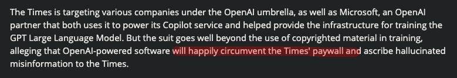

# NYT Sues OpenAI - No Security Is Not Security (Duh)

The <a href="https://arstechnica.com/tech-policy/2023/12/ny-times-sues-open-ai-microsoft-over-copyright-infringement/" target="_blank">NYT is suing OpenAI</a>, listing a variety of complaints, but one specific complaint caught my eye right away.

The Times' suit against OpenAI includes a complaint that ChatGPT "circumvents" the Times' paywall. 🤣 They've got some confused notions about what constitutes "circumvent", "paywall", and "security."

I'm just here to let you know that if client-side data (cookies, etc.) is your mechanism of securing your content, then it's not really security. Web scrapers have been around forever and it should be assumed that they'll ignore and/or delete the browser data you're using to restrict user experience.

Frankly, if I really want to read an article on a site that relies on this behavior, it takes negligible effort to modify the source to make the article visible to me. Usually it's as simple as modifying a single line of code.

Remember that time when <a href="https://www.wired.com/story/missouri-threatens-sue-reporter-state-website-security-flaw/" target="_blank">Missouri Governor Mike Parson tried to criminally charge a journalist for hacking</a> when all that journalist did was view the HTML source for a site (just press F12) and privately point out that they were accidentally exposing over a hundred thousand teachers' SSNs?

I'd like to remind everyone that the <a href="https://en.wikipedia.org/wiki/Streisand_effect" target="_blank">Streisand effect</a> is a thing.

Maybe the Times should just start doing actual journalism and they wouldn't have to worry about becoming irrelevant. Just a crazy thought.

Or you know, build in some actual security. 🤡 
